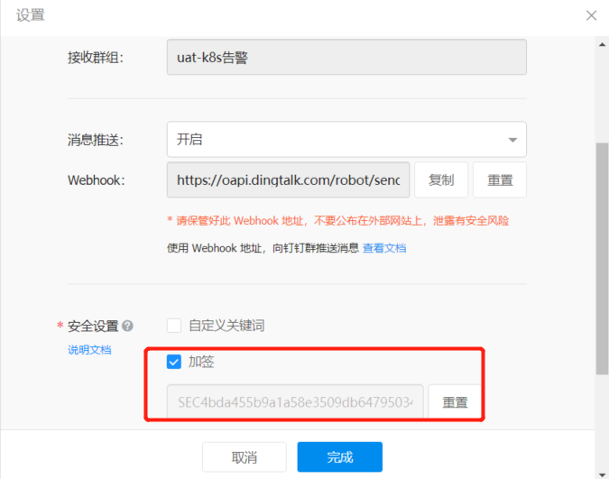
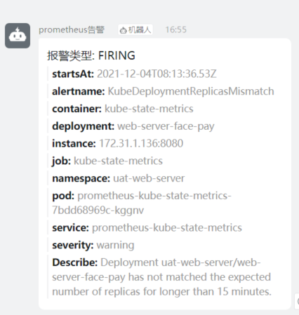

# prometheus-webhook-dingtalk
> prometheus告警推送到钉钉机器人

## 创建钉钉机器人

这里就不再BB了，官方文档有详细说明:[添加机器人到钉钉群 - 钉钉开放平台 (dingtalk.com)](https://developers.dingtalk.com/document/robots/use-group-robots)

*`注意新版的钉钉机器人必需选择安全设置`*

- 本文选用`加签` 等会需要用到。



##  配置secret资源

```bash
$ kubectl create secret generic dingtalk-secret --from-literal=token=<替换webhook-token> --from-literal=secret=<替换加签秘钥SEC开头> -n monitoring
```

##  创建deployment文件

```yaml
apiVersion: apps/v1
kind: Deployment
metadata:
  labels:
    app: webhook-dingtalk
  name: webhook-dingtalk
  namespace: monitoring
  #需要和alertmanager在同一个namespace
spec:
  replicas: 1
  selector:
    matchLabels:
      app: webhook-dingtalk
  template:
    metadata:
      labels:
        app: webhook-dingtalk
    spec:
      containers:
      - image: uhub.service.ucloud.cn/jackhe/prometheus-webhook-dingtalk:v1.1
        name: webhook-dingtalk
        ports:
        - containerPort: 8080
          protocol: TCP
        env:
        - name: ROBOT_TOKEN
          valueFrom:
            secretKeyRef:
              name: dingtalk-secret
              key: token
        - name: ROBOT_SECRET
          valueFrom:
            secretKeyRef:
              name: dingtalk-secret
              key: secret
        resources:
          requests:
            cpu: 100m
            memory: 100Mi
          limits:
            cpu: 500m
            memory: 500Mi
        livenessProbe:
          failureThreshold: 3
          initialDelaySeconds: 30
          periodSeconds: 10
          successThreshold: 1
          timeoutSeconds: 1
          tcpSocket:
            port: 8080
        readinessProbe:
          failureThreshold: 3
          initialDelaySeconds: 30
          periodSeconds: 10
          successThreshold: 1
          timeoutSeconds: 1
          httpGet:
            port: 8080
            path: /
      imagePullSecrets:
        - name: IfNotPresent
---
apiVersion: v1
kind: Service
metadata:
  labels:
    app: webhook-dingtalk
  name: webhook-dingtalk
  namespace: monitoring
  #需要和alertmanager在同一个namespace
spec:
  ports:
  - name: http
    port: 80
    protocol: TCP
    targetPort: 8080
  selector:
    app: webhook-dingtalk
  type: ClusterIP
```

##  alertmanager添加webhook告警路由

```
route:
  receiver: webhook
receivers:
- name: webhook
   webhook_configs:
   - url: http://webhook-dingtalk/dingtalk/send/
```

##  告警效果


## 开发测试
- alertmanager推送的json
```json
{
    "receiver":"webhook",
    "status":"ii",
    "alerts":[
        {
            "status":"33",
            "labels":{
                "alertname":"AlertmanagerFailedToSendAlerts",
                "container":"alertmanager",
                "endpoint":"web",
                "instance":"172.30.84.44:9093",
                "integration":"webhook",
                "job":"prometheus-kube-prometheus-alertmanager",
                "namespace":"monitoring",
                "pod":"alertmanager-prometheus-kube-prometheus-alertmanager-0",
                "prometheus":"monitoring/prometheus-kube-prometheus-prometheus",
                "service":"prometheus-kube-prometheus-alertmanager",
                "severity":"warning"
            },
            "annotations":{
                "description":"Alertmanager monitoring/alertmanager-prometheus-kube-prometheus-alertmanager-0 failed to send +Inf% of notifications to webhook.",
                "runbook_url":"https://github.com/kubernetes-monitoring/kubernetes-mixin/tree/master/runbook.md#alert-name-alertmanagerfailedtosendalerts",
                "summary":"An Alertmanager instance failed to send notifications."
            },
            "startsAt":"2021-12-07T05:58:17.226Z",
            "endsAt":"2021-12-07T05:58:47.226Z",
            "generatorURL":"http://prometheus-kube-prometheus-prometheus.monitoring:9090/graph?g0.expr=%28rate%28alertmanager_notifications_failed_total%7Bjob%3D%22prometheus-kube-prometheus-alertmanager%22%2Cnamespace%3D%22monitoring%22%7D%5B5m%5D%29+%2F+rate%28alertmanager_notifications_total%7Bjob%3D%22prometheus-kube-prometheus-alertmanager%22%2Cnamespace%3D%22monitoring%22%7D%5B5m%5D%29%29+%3E+0.01\\u0026g0.tab=1",
            "fingerprint":"7a23c20f5f0615af"
        }
    ],
    "groupLabels":{
        "job":"prometheus-kube-prometheus-alertmanager",
        "severity":"warning"
    },
    "commonLabels":{
        "alertname":"AlertmanagerFailedToSendAlerts",
        "container":"alertmanager",
        "endpoint":"web",
        "instance":"172.30.84.44:9093",
        "integration":"webhook",
        "job":"prometheus-kube-prometheus-alertmanager",
        "namespace":"monitoring",
        "pod":"alertmanager-prometheus-kube-prometheus-alertmanager-0",
        "prometheus":"monitoring/prometheus-kube-prometheus-prometheus",
        "service":"prometheus-kube-prometheus-alertmanager",
        "severity":"warning"
    },
    "commonAnnotations":{
        "description":"Alertmanager monitoring/alertmanager-prometheus-kube-prometheus-alertmanager-0 failed to send +Inf% of notifications to webhook.",
        "runbook_url":"https://github.com/kubernetes-monitoring/kubernetes-mixin/tree/master/runbook.md#alert-name-alertmanagerfailedtosendalerts",
        "summary":"An Alertmanager instance failed to send notifications."
    }
}
```

